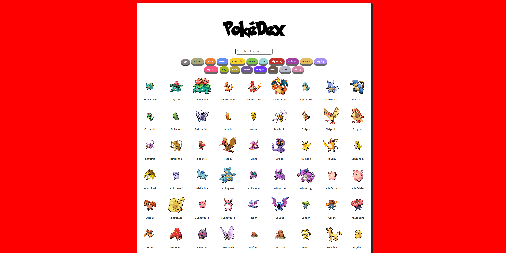
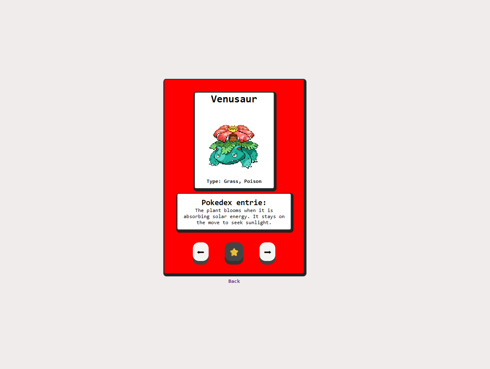

# NewPokeDex

A React + TypeScript Pokedex application that uses the public [PokeAPI](https://pokeapi.co/) to display Pokemon data.

## About The Application

This app lets you browse the first 151 Pokemon, search by name, filter by type, and open a detailed page for each Pokemon.

The detail page includes:

- Pokemon sprite (default and shiny toggle)
- Pokemon types
- English Pokedex flavor text
- Previous and next navigation

## Features

- List view for the first 151 Pokemon
- Name search (case-insensitive)
- Type filter buttons (Normal, Fire, Water, etc.)
- Clickable Pokemon cards that route to a detail page
- Detail page with:
  - Name
  - Sprite image
  - Shiny toggle
  - Type list
  - Flavor text entry
  - Previous / next Pokemon navigation
- Loading and error states with retry support on the list page

## Tech Stack

- React 19
- TypeScript
- Vite
- React Router
- CSS Modules

## API Endpoints Used

- `GET https://pokeapi.co/api/v2/pokemon?limit=151`
- `GET https://pokeapi.co/api/v2/pokemon/{name or id}`
- `GET https://pokeapi.co/api/v2/pokemon-species/{name or id}`

## Getting Started

### 1. Go to the app folder

```bash
cd PokeDex
```

### 2. Install dependencies

```bash
npm install
```

### 3. Start development server

```bash
npm run dev
```

### 4. Build for production

```bash
npm run build
```

### 5. Preview production build

```bash
npm run preview
```

## Available Scripts

Run these inside the `PokeDex` folder:

- `npm run dev` - Starts Vite in development mode
- `npm run build` - Type-checks and builds the app
- `npm run lint` - Runs ESLint
- `npm run preview` - Serves the production build locally

## Project Structure

```text
PokeDex/
	src/
		pages/
			PokedexPage/
			PokemonDetailPage/
		router/
			AppRouter.tsx
```

## Screenshots

### Pokedex List View



### Pokemon Detail View



## Future Improvements

- Add pagination or infinite scroll for more than 151 Pokemon.
- Add sorting options (A-Z, Z-A, by number, by type).
- Improve accessibility (keyboard navigation, ARIA labels, focus states).
- Add unit and integration tests.
- Add favorites stored in local storage.
- Add a compare view for multiple Pokemon.
- Improve loading skeletons and error feedback UX.
- Add optional localization for more languages.

## Notes

- Data is loaded from a third-party API (PokeAPI), so internet access is required.
- If some Pokemon detail requests fail, the list page still shows successfully loaded results.
